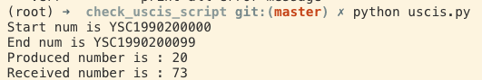

# USCIS helper

A simple Python script help you know more about USCIS status

## Install 

Requirements:

1. Python3.5+
2. Run `pip3 install -r requirements.txt`


## Run

Usage:

```bash

usage: uscis.py [-h] [--start START] [--range RANGE] [--loc LOC] [--seq] [-v]
                [-verr]

optional arguments:
  -h, --help     show this help message and exit
  --start START  Start id
  --range RANGE  Search range
  --loc LOC      Process location, default is YSC
  --seq          Start with sequential version
  -v             print all status
  -verr          print all error message


```

Example:

```
$ python3 uscis.py --start 1990200000 --range 100 
Start num is YSC1990200000
End num is YSC1990200099
Produced number is : 20
Received number is : 73

```

Show all status

```
$ python uscis.py --start 1990200000 --range 10 --seq -v 

Start num is YSC1990200000
End num is YSC1990200009
YSC1990200000:Case Was Received
YSC1990200001:Case Was Received
YSC1990200002:Case Was Received
YSC1990200003:Case Was Received
YSC1990200004:New Card Is Being Produced
YSC1990200005:Case Was Received
YSC1990200006:Case Was Received
YSC1990200007:Case Was Received
YSC1990200008:Case Was Received
YSC1990200009:Card Was Delivered To Me By The Post Office
Produced number is : 2
Received number is : 8

```

## Screenshot




If you don't know how to use it, you can add me wechat account


Welcome star and pull request!
